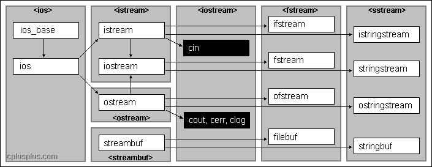

## INDEX  

- [GOAL](#goal)   
		- [Namespaces](#namespaces)   
		- [classes](#classes)   
		- [member functions](#member-functions)   
		- [stdio streams](#stdio-streams)   
		- [initialization lists](#initialization-lists)   
		- [static](#static)   
		- [const](#const)   
---

# GOAL

C++ - Module 00   
Namespaces, classes, member functions, stdio streams, initialization lists, static, const, and some other basic stuf

C++ 모듈 00의 목표는 C++의 기본을 알아보는 시간이다

### Namespaces

그대로 직역하면 `이름 공간`이 된다   
이름으로 공간을 구분한다는 뜻이다

C++에서 Namespace:: 형식으로 사용이 되는데 C언어에서는 add()라는 함수가 한번 선언되면 해당 이름을 다시는 재활용 할 수가 없었다 (동일한 이름을 가진 함수가 선언되면 충돌이 발생함)   

그렇기에 다른 개발자들은 함수이름이 겹치지 않도록 코드를 짜야 했는데 프로그램의 크기가 커지면 커질수록 이러한 함수 이름들은 물론이고 전역변수와 같은 전체적으로 사용되는 이름들에서 중복이 발생하게 되었다   

이러한 중복을 해결하고자 각 중복되는 이름들을 하나의 공간에 몰아넣고 이에 이름을 부여하는 방식으로, 동일한 이름의 함수나 변수를 구분할 수 있게해, 충돌을 방지하고 더 효율적으로 코드를 관리할 수 있게 되었다

### classes

들어가기 앞서 구조체의 개념을 알아볼 필요가 있다   
C++에서는 C의 구조체를 좀더 업그레이드를 하여 여러 기능을 추가시켰다      
얼마나 업그레이드 되었는지는 [여기](https://www.geeksforgeeks.org/difference-c-structures-c-structures/)에서 확인하면 된다   
보면 기존의 C 구조체에서는 데이터 멤버만 허용되었지만 C++ 구조체에서는 멤버 함수도 포함될 수 있도록 했다는 부분만 알고 넘어가면된다   


`class == struct(C++) + 접근 제어자` 로 해석하면 된다      

[참고자료](https://www.geeksforgeeks.org/structure-vs-class-in-cpp/)

#### 접근제어자

클래스 멤버에 대한 접근성을 지정하는 역할   
즉 클래스 외부에서 접근할 수 있는지 없는지에 대한 결정을 한다   

### member functions

멤버 함수

클래스 또는 구조체 안에서 정의된 함수로 객체의 상태(데이터 멤버)를 조작하거나 동작을 수행하는데 사용된다   
클래스 내부의 함수는 클래스 내부의 객체(인스턴스)에 접근할 수 있으며 데이터를 다룰 수 있는 권한이 있다   

### stdio streams



기존 C에서는 stdio를 사용했지만 C++에서는 기존의 함수 기반의 입출력 방식이아닌 객체 지향적인 접근으로 만들어낸 iostream을 사용한다

### initialization lists

초기화 리스트, 생성자 뒤에 `:`으로 시작하고, 생성자 뒤에 쉼표로 구분된 리스트 형식으로 표기된다

**e.g.**
```c++
#include <iostream>
using namespace std;
 
class Point {
private:
    int x;
    int y;
 
public:
    Point(int i = 0, int j = 0): x(i), y(j) {}
    /* 초기화 리스트 대신 생성자를 다음과 같이 작성해도 된다
        Point(int i = 0, int j = 0) {
            x = i;
            y = j;
        }
    */
 
    int getX() const { return x; }
    int getY() const { return y; }
};
 
int main() {
    Point t1(10, 15);
    cout << "x = " << t1.getX() << ", ";
    cout << "y = " << t1.getY();
    return 0;
}
```

다음은 초기화 목록을 사용해야 하는 순간들을 나열한 것이다

1. non-static const 데이터 멤버의 초기화   
	const 데이터 멤버는 심볼 테이블에 포함되는 메모리이기 때문이다
2. reference 멤버의 초기화   
	애초에 초기화가 안되어 있으면 컴파일러가 오류를 뱉는다
3. 기본 생성자가 없는 멤버 객체의 초기화   
	클래스 A의 객체를 포함한 클래스 B가 있다고 가정해보자,   
	클래스 A에 기본 생성자와 매개변수가 있는 생성자가 모두 있다 하더라도 매개변수가 있는 생성자를 사용하려면 반드시 초기화 리스트를 사용해야한다   
	당연히 클래스 A에 기본 생성자조차 없다면 초기화 리스트를 사용해야한다   
4. 기본 클래스 멤버의 초기화   
	기본 클래스(base class)와 파생 클래스(derived class)간의 관계에서, 파생 클래스의 생성자가 호출될 때 기본 클래스의 생성자가 먼저 호출된다   
	그러나 기본 생성자가 없거나 매개변수가 있는 생성자만 있다면 초기화 리스트를 통해 기본 클래스의 생성자를 명시적으로 호출해야 한다   
5. 생성자의 매개변수 이름이 데이터 멤버와 동일한 경우   
	this 포인터를 대신 사용하여 초기화 해줄수 있다   
6. 성능을 위해   

[초기화 리스트 사용 안했을때](./test/InitializationListNotUse.cpp)   
[초기화 리스트 사용 했을때](./test/InitializationListUse.cpp)   
위의 두 예제로 알 수 있는 것은 초기화 리스트를 사용함으로서 멤버 변수 사용시 불필요한 대입을 줄일 수 있기 때문에 성능이 좋아진다

[출처](https://www.geeksforgeeks.org/output-of-c-program/)

**p.s.**

초기화 parameter initialization ()를 사용하는 것보다 uniform initialization {}을 사용하는 편이 컴파일러가 엄격한 타입체크를 제공하여 잠재적인 narrowing conversions를 방지할 수 있다

### static

C++의 키워드

3가지 특징과 사용처가 있다

1. static storage duration을 가진다   
	static으로 선언된 모든 변수가 가진 프로그램이 시작될 때부터 끝날 때까지 존재하는 변수의 생명 주기    
	정적 변수는 처음 한번만 초기화되며, 프로그램이 종료될 때까지 그 값을 유지한다   
2. 심볼 테이블 & 초기화   
	정적 변수의 data는 심볼 테이블에 담기게 되는데 이 때문에 컴파일 단계에서 초기화가 이미 이루어져 있어야 한다   
	그렇기에 명시적으로 초기값을 지정하지 않으면, 자동으로 0으로 초기화 된다   
3. block scope variable에 static 키워드를 붙이게 되면 scope를 벗어나더라도 해당 변수는 메모리에 남아있게 된다   

사용처는 다음과 같다
1. static storage duration과 internal linkage를 가진 namespace 멤버의 선언   
2. static storage duration을 가진 block scope variables의 정의 및 한 번만 초기화 되는 변수   
3. 특정 인스턴스에 바인딩되지 않은 클래스 멤버의 선언   

		internal linkage:
		static 키워드가 namespace 범위 또는 전역 변수에 사용시 그 변수나 함수는 해당 파일 내에서만 접근이 가능하다
		이로인해 파일간의 전역 변수 충돌을 방지할 수 있다
		(C와 동일함)

		block scope variables:
		함수 내에서 선언된 변수로 해당 블록 {}이 끝나면 소멸되는 변수

### const

상수를 지정하는 키워드

선언 시점에 초기화를 반드시 해야 하며, 값을 할당 할 수 없다

const가 위치한 곳에 따라 주체가 달라진다
[const test](./test/ConstTest.cpp)를 통해 확인 할 수 있다

```c++
// *var 수정 불가능
const type* var;
// var 수정 불가능
type* const var;
//
const type* const var;
const class name object name
```
p.s.   
[주소값 테스트](./test/ConstMemoryLayout.cpp)를 다른 컴파일러로 컴파일시 다른 메모리영역에 담기게 되는것을 보아 컴파일러나 환경에 따라 언제든 다른 메모리 영역에 담길 수 있음을 알 수 있다   
