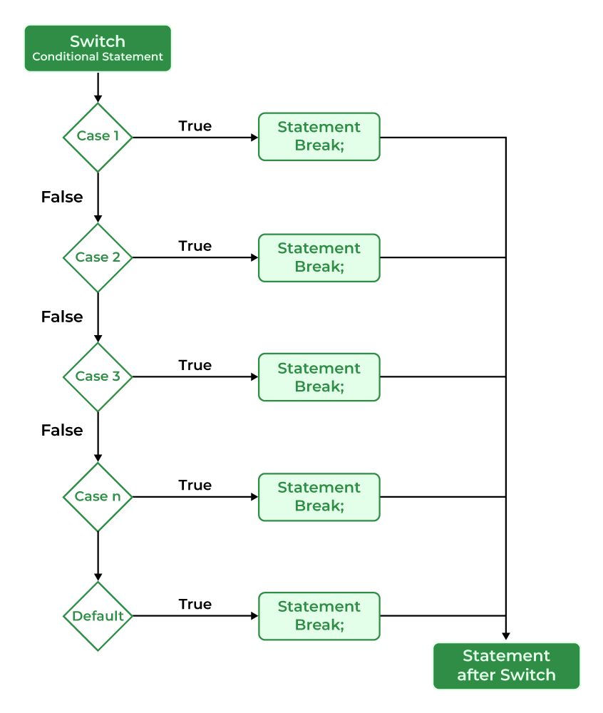

### switch statement

**Syntax**   
`attr(optional) switch ( init-statement(optional) condition ) statement`

`attr`	-	(since C++11) 아무 속성값 숫자     
`init-statement`	-	(since C++17) 다음중 하나:   
명령문 표현식 (nullptr일 수 있음)   
간단한 선언, 일반적으로 초기화가 있는 변수의 선언이지만, 여러 변수나 구조화된 바인딩을 선언할 수도 있다
별칭 선언일 수도 있음 (since C++23)   
어떤 초기화 문이라도 반드시 세미콜론으로 끝나야 한다는점에 유의해야한다   
이는 비공식적으로는 세미콜론으로 끝나는 표현식이나 선언으로 자주 설명되는 이유이다   

`condition`	-	조건   
`statement`	-	명령문

switch 문의 조건에는 상수값을 가져야한다

```c++
// 상수 표현식 허용 
switch(1+2+23) 
switch(1*2+3%4) 

// 변수 표현식 허용 
// 고정된 값이 할당된 경우 
switch(a*b+c*d) 
switch(a+b+c)
```

**Label**   

`attr(optional) case constant-expression:`   
`attr(optional) default:`   

`attr`	-	(since C++11) 아무 속성값 숫자   
`constant_expression`	-	int or char type
`default`	-	해당 키워드는 일치하는 케이스 값이 없을 때 실행되는 기본 케이스를 정의하는데 사용된다 이는 선택사항이다    

case값에는 중복된 값이 허용되지 않으며 모든 case값은 고유해야 한다   
또한 C++에서는 한 스위치를 다른 스위치 문 안에 중첩할 수 있지만 이는 가독성과 프로그램의 복잡성을 높이기에 피하는 것이 좋다   

*switch 문의 흐름도*



[*switch 문 예제*](./test/SwitchStatement.cpp)


